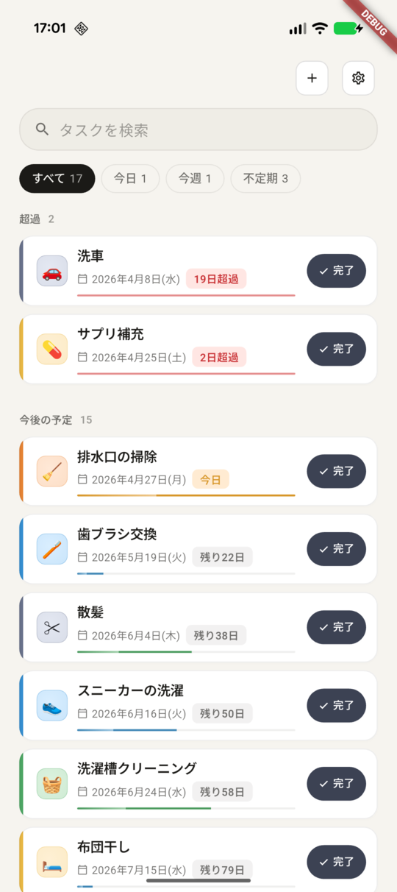
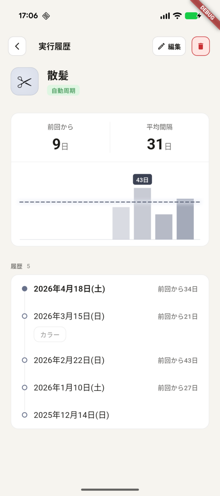
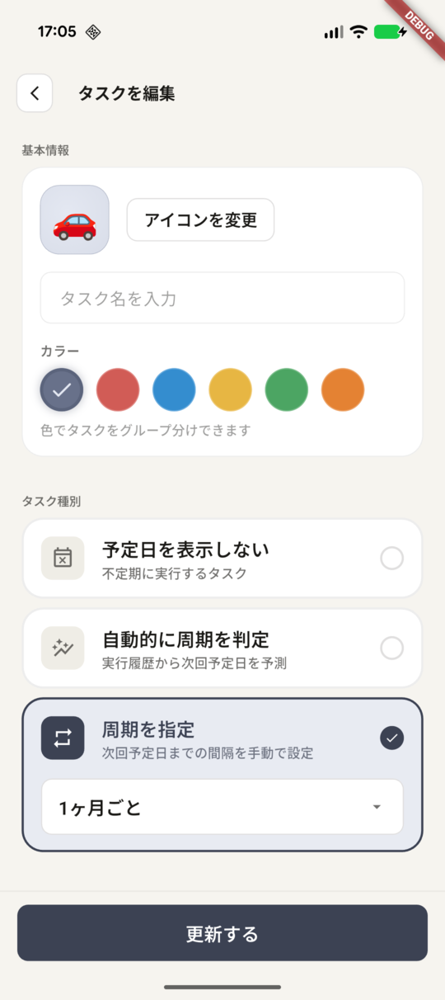

# dawnbreaker

定期的なタスクを管理するアプリ

## アプリ説明

TODOアプリ的なものではなく、以下のような定期的にやらなければならないものを可視化して、忘れないようにするためのツール。

### 定期的に実行するタスクを登録

- 屋外の虫除けの期限
- 浴室のカビ取り剤の交換

**いつやらないといけないんだっけ？** の可視化。

### 定期的に行っていることを記録

- 備品のストックの買い出し
- 理髪店の利用

**どのくらいの頻度でやってるんだっけ？** を可視化。

## スクショ

ホーム | タスク詳細 | タスク編集
---- | --- | --- 
 |  | 

## 技術的狙い

- [ ] `Flatter` / `dart` の学習と実践（以前学んだ内容から結構変わっている部分が多いのでそのキャッチアップ）。
- [x] `MethodChannel` を使ったネイティブ実装とのブリッジ。

### 技術スタック

| カテゴリ | ライブラリ / ツール |
|---|---|
| UI フレームワーク | Flutter |
| 状態管理 | Riverpod |
| モデル | Freezed |
| ルーティング | go_router |
| データ永続化 | drift |