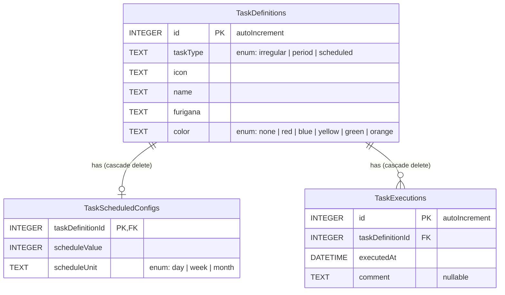

# Database Schema

## テーブル概要

### TaskDefinitions

タスクの定義情報。`taskType` によってスケジュール設定の有無が変わる。

| カラム | 型 | 説明 |
|---|---|---|
| id | INTEGER PK | 自動採番 |
| taskType | TEXT | `irregular`（不定期）/ `period`（周期）/ `scheduled`（スケジュール済み）|
| icon | TEXT | アイコン識別子 |
| name | TEXT | タスク名 |
| furigana | TEXT | ふりがな（ソート用） |
| color | TEXT | `none` / `red` / `blue` / `yellow` / `green` / `orange` |

### TaskScheduledConfigs

スケジュール設定。`TaskDefinitions` と 1:1 の関係（`taskDefinitionId` が PK）。

| カラム | 型 | 説明 |
|---|---|---|
| taskDefinitionId | INTEGER PK, FK | `TaskDefinitions.id` 参照 |
| scheduleValue | INTEGER | 周期の数値 |
| scheduleUnit | TEXT | `day` / `week` / `month` |

### TaskExecutions

タスクの実行履歴。インデックスは `(taskDefinitionId, executedAt)`。

| カラム | 型 | 説明 |
|---|---|---|
| id | INTEGER PK | 自動採番 |
| taskDefinitionId | INTEGER FK | `TaskDefinitions.id` 参照 |
| executedAt | DATETIME | 実行日時 |
| comment | TEXT? | メモ（任意） |